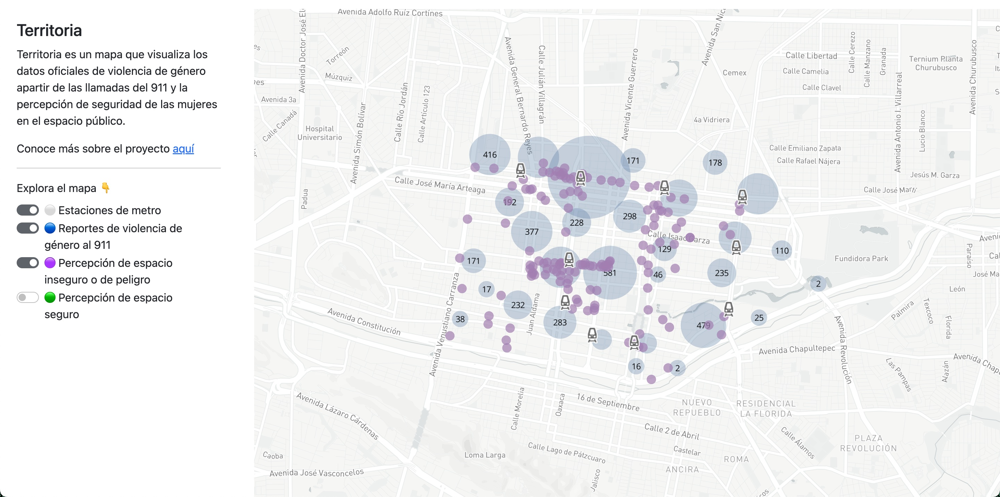

## Territoria

Territoria is a map that visualizes unsafe places for women that walk in the streets of Monterrey, Mexico. The map is one 
of the tools that the team at Georregias (NGO) uses to help women move around the city with a greater sense of security.

Territoria uses gender violence reports from Monterrey's open data portal [datos.monterrey.gob.mx](https://datos.monterrey.gob.mx/) and
a street survey aimed at women that walk every day through the city.

The map has 4 layers:
- "Estaciones de metro" = Subway station
- "Reportes de violencia de género al 911" = 911 gender violence reports
- "Percepción de espacio inseguro de peligro" = Locations with a perception of insecurity or real danger
- "Percepción de espacio seguro" = Location with a perception of security

Territoria was built using the framework Dash (Plotly) in Python.

You can take a look at the map at www.georregias.com/territoria
